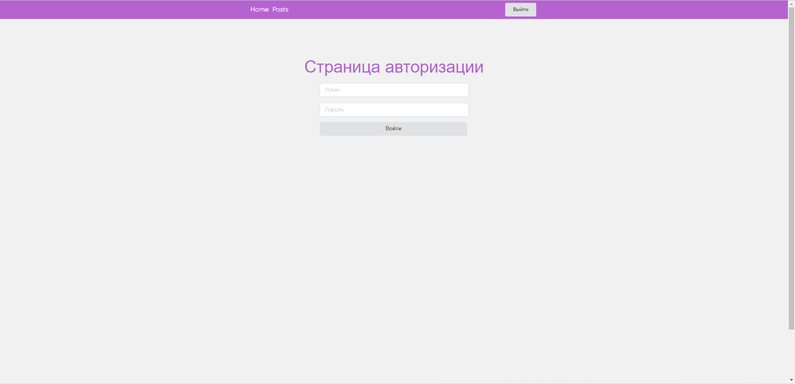
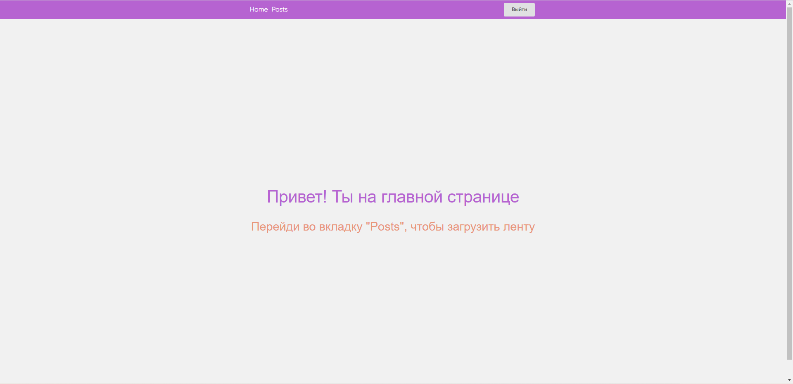
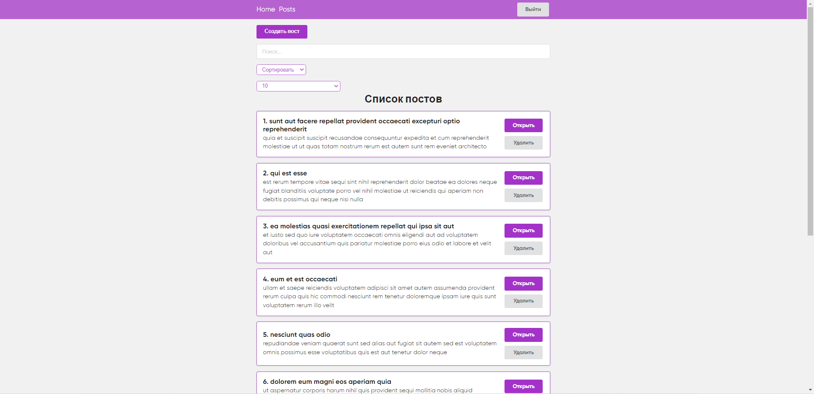
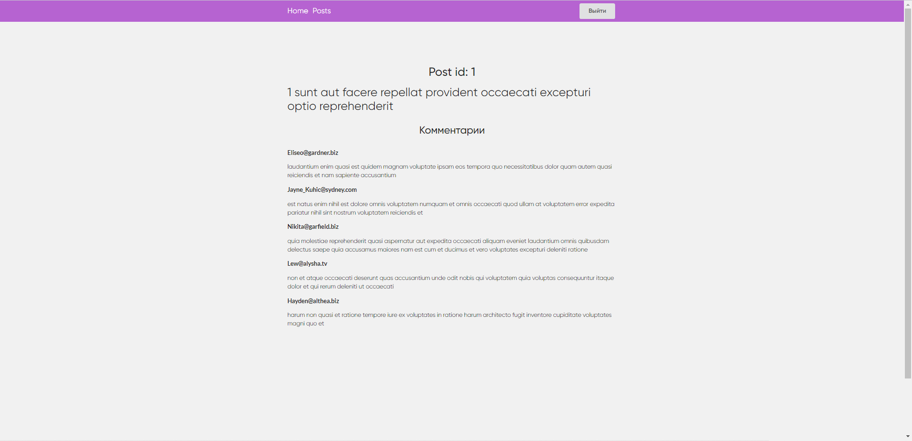
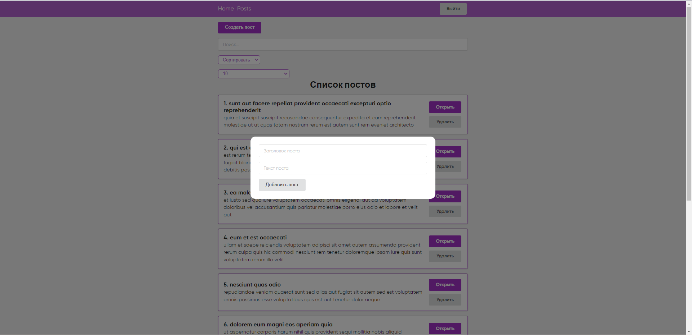

# Getting Started with Create React App

This project was bootstrapped with [Create React App](https://github.com/facebook/create-react-app).

A news app that fetches post items from jsonplaceholder and renders them into an infinite posts feed (limited by a number of available posts on jsonplaceholder). The app allows to sort, search, add and remove posts from the feed. The app contains both public and private pages that a user can visit dependeing on whether user is logged in or logged out. The app allows user to open any post page that renders individual content and comments.

## Check app screenshots below:
### Login page

### Home page

### Posts page

### Individual post page

### Modal

## Available Scripts

In the project directory, you can run:

### `yarn start`

Runs the app in the development mode.\
Open [http://localhost:3000](http://localhost:3000) to view it in your browser.

The page will reload when you make changes.\
You may also see any lint errors in the console.

### `yarn build`

Builds the app for production to the `build` folder.\
It correctly bundles React in production mode and optimizes the build for the best performance.

The build is minified and the filenames include the hashes.\
Your app is ready to be deployed!

See the section about [deployment](https://facebook.github.io/create-react-app/docs/deployment) for more information.
